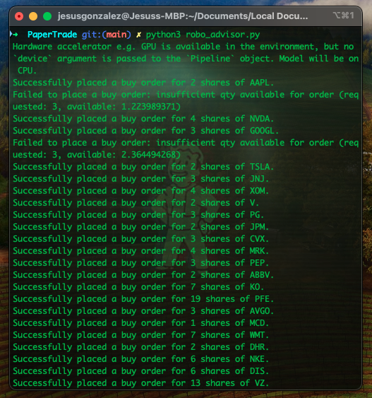

# PaperTrade

A simple robo-advisor that incorporates sentiment analysis from news headlines with stock positions to make recommendations and execute trades. 

🤖 [Presentation Slides](https://docs.google.com/presentation/d/1yZM2L5jBCDtRupBxp9c0eHQkyIx3AIo_yMnSMaY1LgI/edit#slide=id.p1)